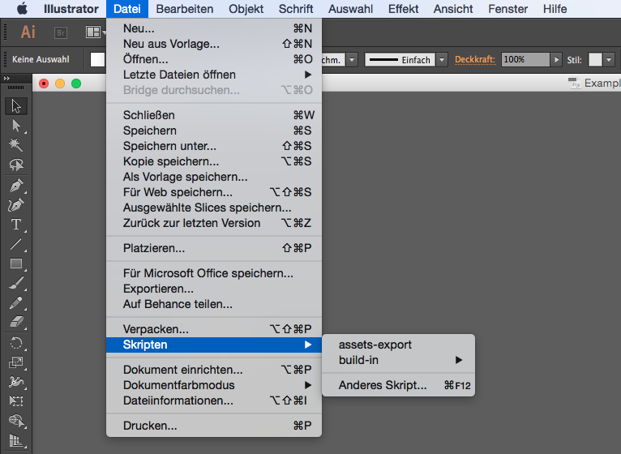

#Graphical assets export for Android and iOS

This Adobe Illustrator Script exports the recommended grafic assets for Android and iOS from an SVG file. Whitespaces are generelly not allowed for filenames and only lowercase character, numbers, dots and underscores are valid filename parts for Android resources [a-z0-9_.].

The size of the SVG correlates to the size of the default image bucket. Other dimensions will be calculated automatically.

## Step 1

To export grafic assets with this script, your can select ```File -> Scripts -> Other Script...``` and choose ```export.jsx``` or clone this repository into the following directory:

	/Applications/Adobe Illustrator CC 2014/Presets.localized/en_US/Scripts
	



## Step 2

Select the destination directory.


## Step 3

Choose a valid name for exported PNGs.


##Example

If the SVG is 48x48 the Android grafic bucket with resource qualifier drawable-mdpi will be filled with an PNG with 48x48 pixels. If we select and SVG named Example.svg and choosed the name Example, this script will export the following files for Android and iOS:

##Android Assets

	res/drawable-ldpi/example.png
	res/drawable-mdpi/example.png
	res/drawable-hdpi/example.png
	res/drawable-xhdpi/example.png
	res/drawable-xxhdpi/example.png
	res/drawable-xxxhdpi/example.png

##iOS Assets

	Example.png
	Example@2x.png
	Example@3x.png
